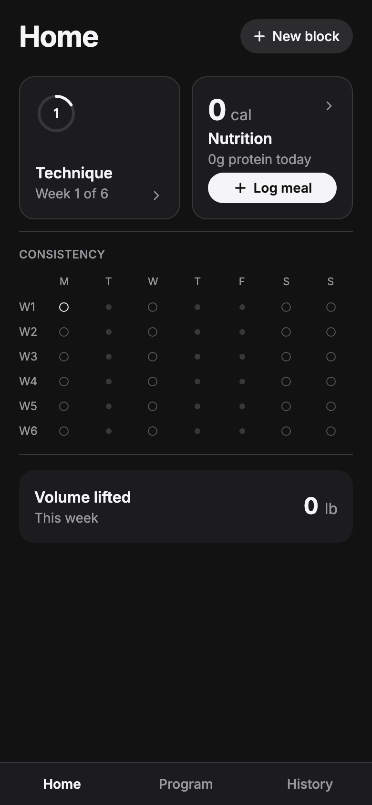
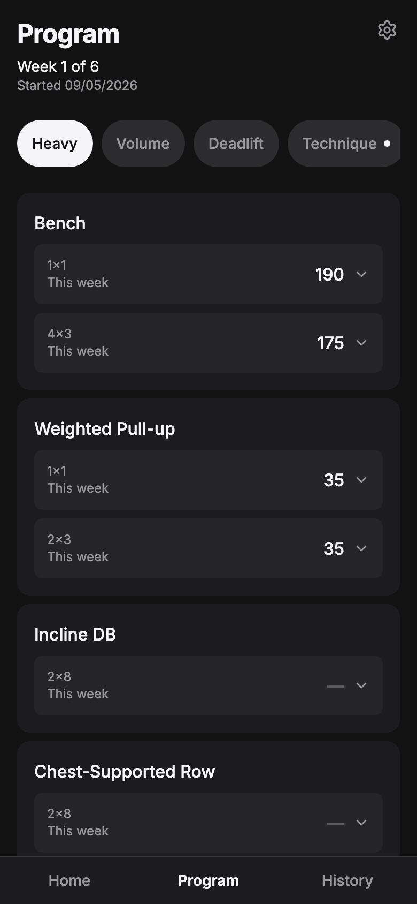
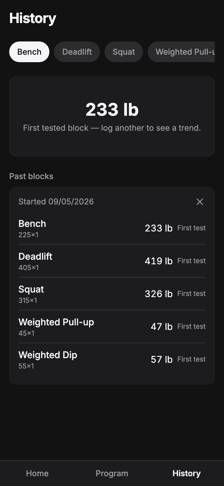

# Consistency

A percentage-based strength training tracker: test a lift, get an auto-generated 6-week training block, log your sets, and watch the app learn your real strength curve over time instead of trusting a static formula.

**Live app:** [consistency-azure.vercel.app](https://consistency-azure.vercel.app)

<p align="center">
  
  
  
</p>

## What problem this solves

Serious strength programs (powerlifting, weighted calisthenics) are usually run as percentages of a tested one-rep max: test your max, then every set for the next several weeks is some percentage of that number. Recalculating those numbers by hand in a spreadsheet every block is tedious enough that it gets skipped — which is the actual inconsistency this app is named after. Most fitness-tracking apps either have no programming logic at all, or use a one-size-fits-all max-estimation formula that gets less accurate the longer you train.

Consistency does the recalculation automatically, and adjusts its own estimate of your max over time based on your real logged performance.

## Core features

- **Auto-generated 6-week blocks.** Test a lift (a straight rep max, an RPE-based estimate, or a manual number), and every set-group tied to that lift gets its week-by-week weight targets computed for you — 5 programmed weeks plus an unprogrammed deload week.
- **Real program structure, not "one lift, one number."** Several training days a week, several exercises per day, and a single exercise can carry more than one independent set/rep scheme in the same day (e.g. a top single at one percentage and a separate back-off block at another). A variant lift (Paused Bench) can borrow another lift's tested max at its own percentage instead of needing its own test.
- **Three progression types, picked per lift:** percentage-of-tested-max with weekly increments (most lifts), a flat weekly added-weight increment off the tested max (for lifts where a fixed jump makes more sense than a percentage — decided after researching how percentage-based programming for weighted pull-ups actually performs in practice), or fully freeform/RPE-autoregulated for accessory work.
- **A personal correction factor.** RPE-tagged sets feed an exponential-moving-average adjustment that nudges the static Epley formula toward how the lift is actually responding for that specific person, gated behind a trust threshold so a single noisy RPE reading can't swing next block's targets.
- **History.** An E1RM trend chart per lift, plus every past block's test result and the delta from the one before it.
- **Nutrition tracking**, separate from training: daily calorie/protein logging with 7/14/30-day trend charts against a set goal.
- **In-app program editor.** Exercises, training days, and set/rep schemes are all edited through the UI (Manage Program) instead of hand-written SQL migrations.
- **Multi-tenant.** Real accounts via Supabase Auth; every table is scoped to its owner with Postgres row-level security, and a brand-new account bootstraps its own editable starter program.
- **Installable PWA**, built mobile-first.

## Tech stack

React 19 · TypeScript · Vite · Tailwind CSS · Supabase (Postgres, Auth, Row-Level Security) · deployed on Vercel

## Running it locally

```bash
npm install
npm run dev
```

You'll need your own Supabase project — copy `.env.example` to `.env.local` and fill in `VITE_SUPABASE_URL` and `VITE_SUPABASE_PUBLISHABLE_KEY`, then run `supabase/schema.sql` against it. A fresh account starts empty; use the in-app "set up starter program" button to seed an editable example program.

## Status

Actively used to run real training blocks, not a one-off class project — the schema and progression logic have been tuned against real logged data and, where the numbers mattered enough to get wrong, actual research rather than guesses (see the comments in `supabase/migrations/`).
